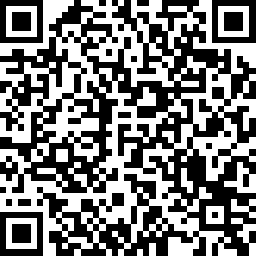

# Activate Thrusters

In the last part of the session, we're going to briefly look at a few areas to potentially look into in more detail, then we can do Q&A and dive into any areas of particular interest. After the session you'll still have opportunities to chat to the team about specific topics.

## 1. Collaboration in Postman

We saw earlier that you can create workspaces in Postman. There are various other features designed to support collaboration.

* You can invite people to workspaces.
* With paid accounts you can specify role based access control.
* You can use version control on APIs and collections.
  * Fork, merge, open pull requests.
* View changelogs for collections, teams, workspaces.

**Check out the [Collaboration docs](https://learning.postman.com/docs/postman/collaboration/collaboration-intro/)**

## 2. Monitors

We saw earlier how you can run the requests in a collection using the collection runner. You can schedule these to run and analyze performance using monitors.

* Open a collection and choose the __Monitors__ tab.
* Create a monitor and setup details including run frequency.
* View monitor results in the web dashboard.

**Check out the [Monitoring docs](https://learning.postman.com/docs/postman/monitors/intro-monitors/)**

## 3. Mock data

You can use Postman to mock data during API design or development. Mocks use examples you specify in Postman to provide test data.

* Open a collection and select the __Mocks__ tab.
* Create a new mock, giving it a name.
* Add examples.
* Use the mock server URL in your requests to return example data instead of hitting the actual API. _If you set your URL as a variable you can swap the mock URL in there while designing and developing your API._

**Check out the [Mock Server docs](https://learning.postman.com/docs/postman/mock-servers/intro-to-mock-servers/)**

## 4. API specifications

You can define and model your API using a specification inside Postman. Postman API Builder can act as the single source of truth through multiple phases of your development and testing process.

* In Postman, open __APIs__ on the left.
* You can import or write a spec, for example OpenAPI (formerly Swagger).
* You can generate collections from a spec.
* You can validate against a spec.
* You can connect various other elements to your schema, e.g. mocks, monitors, tests.

**Check out the [API Builder docs](https://learning.postman.com/docs/postman/design-and-develop-apis/the-api-workflow/)**

## 5. Visualize data

You can create test scripts that visualize response data when your requests run. Visualizations can include graphs, charts, and interactive elements using JavaScript libraries.

* Import the `Visualizer Examples` or `Visualizer Feature Templates` collections.
* Pick any request and __Send__. When the response comes back, select __Visualize__. To see the code building the visualizations, select the __Tests__ tab. You can use JavaScript visualization libraries such as D3.

**Check out the [Visualizer docs](https://learning.postman.com/docs/postman/sending-api-requests/visualizer/)**

## Survey

Please take a few minutes to fill out the survey so that we can make future workshops as useful as possible.

__[bit.ly/postman-dublin-survey](http://bit.ly/postman-dublin-survey)__

## Kahoot

__Go to [kahoot.it](https://kahoot.it/) and enter the pin show on the screen—answer the questions as quick as you can to win an Amazon gift card!__

](https://apod.nasa.gov/apod/image/1712/WinterSolsticeMW_Seip.jpg)

## Additional resources

* [Get support on the Postman community forum](https://community.getpostman.com/)
* [Check out the docs](https://learning.postman.com/docs/)
* [Explore the API Network](https://explore.postman.com/)

## Next steps

Follow-up topics for further learning:

* __GraphQL__
  * You can write GraphQL queries and specs in Postman. Import the template `Working with GraphQL` and check it out.
* __Interceptor__
  * Postman Interceptor allows you to sync cookie data for specified domains. Check out [the docs](https://learning.postman.com/docs/postman/sending-api-requests/interceptor/).
* __Codegen__
  * If you use code generation in Postman, you can customize how your code is generated using the __Settings__ &gt; __New Code Generation Mode__ option then clicking __Code__ in a request and opening the settings to configure the detail for specific languages.
* __Console__
  * The Postman Console provides debugging info you can use when troubleshooting your requests—and has recently had an upgrade. Import the template `How to use the Postman console`, open the console from the bottom left, and run the request `message types`, observing the info you can access in the console display.

## Survey

Please fill out the feedback survey before we finish! _URL_
